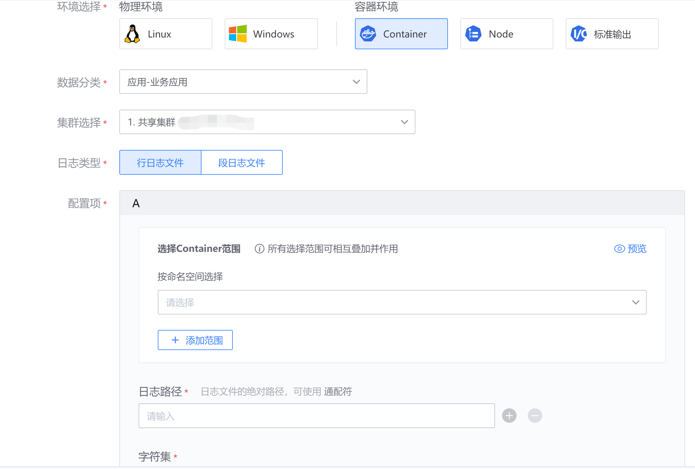

# 容器日志采集接入

为满足上云的场景需要，日志平台支持容器日志的采集。在环境选择选项中选择“容器环境”，支持Container、Node、标准输出三种模式。

**导航路径**：操作步骤：环境选择 - 数据分类 - 集群选择 - 日志类型【支持行日志、段日志】 - 配置项 - 链路配置；

根据所选容器环境不同，配置项存在一定区别：

Container、标准输出支持按照命名空间、按标签、按工作负载、直接指定Container。多项配置会相互叠加作用，点击预览可查询本次配置生效范围；Node暂时只支持按标签选择；

**预览**

多项配置会同时生效，最终所选范围为所有配置项范围交集。点击右侧预览，可查看配置生效范围；

**日志路径**

* 日志是绝对路径和日志轮转
* 可以支持通配符方式，具体查看常见通配符
* 可以支持多日志文件

**日志内容过滤**

* 支持字符串过滤：选择 include，保留命中字符串的日志，未命中的日志将丢弃
* 支持分割符过滤：可选择系统预设分隔符‘|’ ‘ , ’‘ ; ’ ' '空格'进行过滤

**附加日志标签**

可以手动附加日志标签，也可勾选“自动添加Pod中的labels”生成标签

**日志链路**

就近传输日志和存储，具体查看链路管理